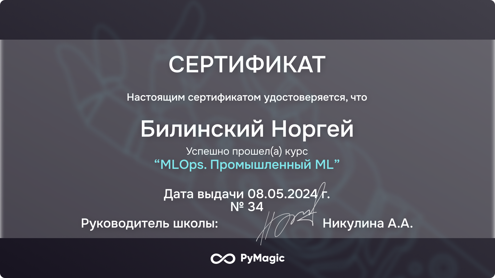

- 👋 Hi, I’m **@Norgey Bilinskiy**  

- **Junior Data Scientist**  

- Занимаюсь аналитикой данных и разработкой моделей машинного обучения. Изучаю методы сбора данных, обработку временных рядов, а также технологии MLOps (AirFlow, Docker).  

- Интересуюсь задачами в области **time series** (финансы, производство, маркетинг), автоматизацией аналитических процессов и прогнозированием.  

## Образование  
### Томский Государственный Университет  
- **Институт:** Прикладной математики и компьютерных наук  
- **Ступень:** Магистратура, II курс  
- **Направление:** Интеллектуальный анализ Big Data  
- **Средний балл:** 5,0  

## Дополнительное образование  
- **GeekBrains:** Аналитика данных (1 год), Data Science (в процессе обучения, 1 год)  
- **PyMagic:** MLOps-промышленный ML  

## Сертификаты и дипломы  
- **MLOps-промышленный ML (PyMagic)**  

  

### Опыт работы  
**Data Scientist** — *Headlines* (март 2024 — настоящее время)    

